# Требования к Telegram-боту для генерации карточек товаров

## 1. Общее описание

Telegram-бот для генерации карточек товаров и услуг на основе изображений с использованием нейросети. Пользователь отправляет одно изображение и текст к нему одним сообщением, бот генерирует карточку товара/услуги.

> 📎 Прототип: 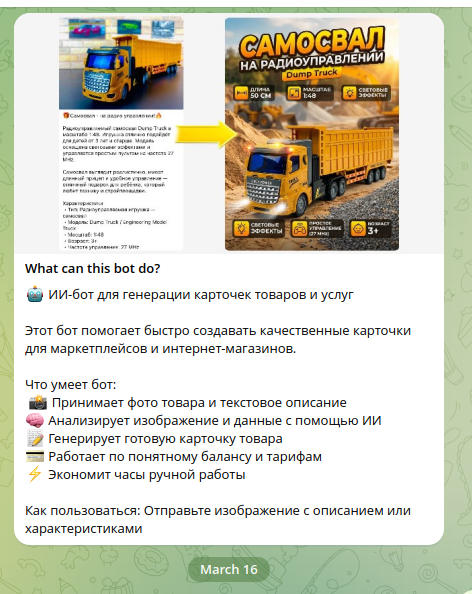

---

## 2. Структура главного меню

> 📎 Прототип: 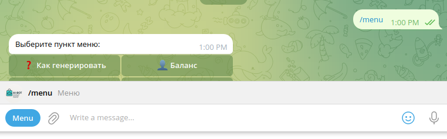 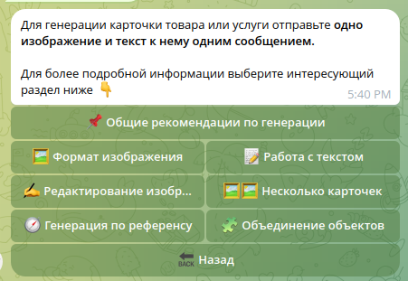

При старте бот отправляет сообщение:

> Для генерации карточки товара или услуги отправьте **одно изображение** и **текст к нему одним сообщением**.
>
> Для более подробной информации выберите интересующий раздел ниже

### Inline-кнопки главного меню (сетка 2 колонки + кнопка "Назад"):

| Кнопка | Эмодзи |
|--------|--------|
| Общие рекомендации по генерации | :sparkles: |
| Формат изображения | :frame_with_picture: |
| Работа с текстом | :pencil: |
| Редактирование изображений | :art: (кисть) |
| Несколько карточек | :card_file_box: |
| Генерация по референсу | :mag: |
| Объединение объектов | :jigsaw: |
| Назад | :back: |

---

## 3. Разделы информации (справочные экраны)

Каждый раздел отображается как текстовое сообщение с кнопкой "Назад" внизу.

### 3.1. Общие рекомендации по генерации

> 📎 Прототип: 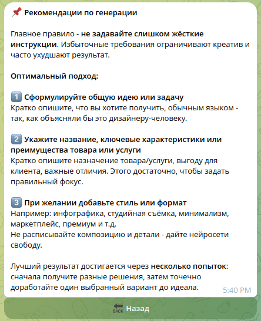

**Заголовок:** :sparkles: Рекомендации по генерации

**Содержание:**

Главное правило — **не задавайте слишком жёсткие инструкции**. Избыточные требования ограничивают креатив и часто ухудшают результат.

**Оптимальный подход:**

1. **Сформулируйте общую идею или задачу** — Кратко опишите, что вы хотите получить, обычным языком — так, как объясняли бы это дизайнеру-человеку.
2. **Укажите название, ключевые характеристики или преимущества товара или услуги** — Кратко опишите назначение товара/услуги, выгоду для клиента, важные отличия. Этого достаточно, чтобы задать правильный фокус.
3. **При желании добавьте стиль или формат** — Например: инфографика, студийная съёмка, минимализм, маркетплейс, премиум и т.д. Не расписывайте композицию и детали — дайте нейросети свободу.

Лучший результат достигается через **несколько попыток**: сначала получите разные решения, затем точечно доработайте один выбранный вариант до идеала.

---

### 3.2. Формат изображения

> 📎 Прототип: 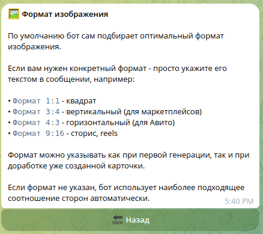

**Заголовок:** :frame_with_picture: Формат изображения

**Содержание:**

По умолчанию бот сам подбирает оптимальный формат изображения.

Если нужен конкретный формат — просто укажите его текстом в сообщении, например:

- **Формат 1:1** — квадрат
- **Формат 3:4** — вертикальный (для маркетплейсов)
- **Формат 4:3** — горизонтальный (для Авито)
- **Формат 9:16** — сторис, reels

Формат можно указывать как при первой генерации, так и при доработке уже созданной карточки.

Если формат не указан, бот использует наиболее подходящее соотношение сторон автоматически.

---

### 3.3. Работа с текстом

> 📎 Прототип: 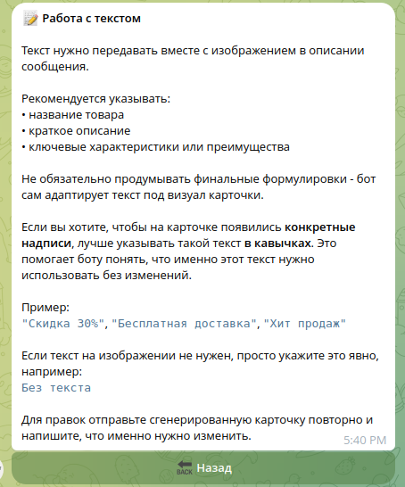

**Заголовок:** :pencil: Работа с текстом

**Содержание:**

Текст нужно передавать вместе с изображением в описании сообщения.

Рекомендуется указывать:
- название товара
- краткое описание
- ключевые характеристики или преимущества

Не обязательно продумывать финальные формулировки — бот сам адаптирует текст под визуал карточки.

Если вы хотите, чтобы на карточке появились **конкретные надписи**, лучше указывать такой текст **в кавычках**. Это помогает боту понять, что именно этот текст нужно использовать без изменений.

Пример:
> "Скидка 30%", "Бесплатная доставка", "Хит продаж"

Если текст на изображении не нужен, просто укажите это явно, например:
> Без текста

Для правок отправьте сгенерированную карточку повторно и напишите, что именно нужно изменить.

---

### 3.4. Редактирование изображений (планируется)

> 📎 Прототип: 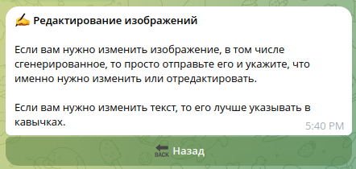

**Заголовок:** :art: Редактирование изображений

**Содержание:**

Если вам нужно изменить изображение, в том числе сгенерированное, то просто отправьте его и укажите, что именно нужно изменить или отредактировать.

Если вам нужно изменить текст, то его лучше указывать в кавычках.

---

### 3.5. Несколько карточек и вариантов (планируется)

> 📎 Прототип: 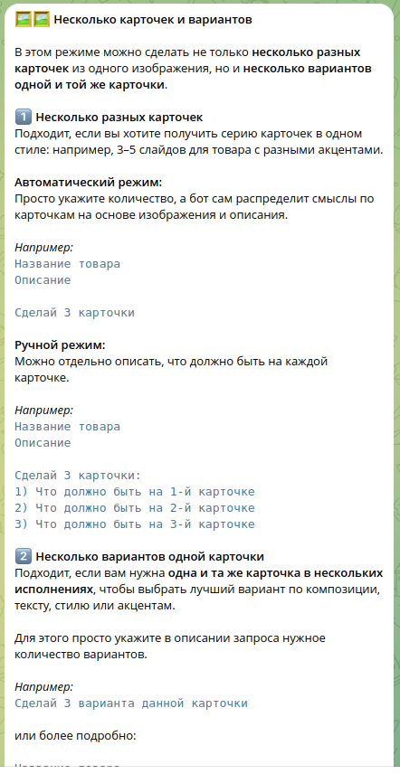 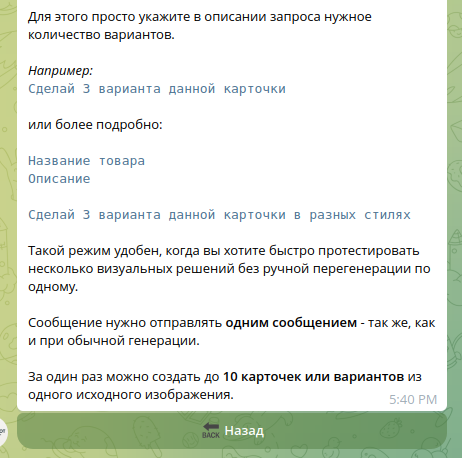

**Заголовок:** :card_file_box: Несколько карточек и вариантов

**Содержание:**

В этом режиме можно сделать не только **несколько разных карточек** из одного изображения, но и **несколько вариантов одной и той же карточки**.

#### 1) Несколько разных карточек

Подходит, если вы хотите получить серию карточек в одном стиле: например, 3–5 слайдов для товара с разными акцентами.

**Автоматический режим:**
Просто укажите количество, а бот сам распределит смыслы по карточкам на основе изображения и описания.

Например:
```
Название товара
Описание

Сделай 3 карточки
```

**Ручной режим:**
Можно отдельно описать, что должно быть на каждой карточке.

Например:
```
Название товара
Описание

Сделай 3 карточки:
1) Что должно быть на 1-й карточке
2) Что должно быть на 2-й карточке
3) Что должно быть на 3-й карточке
```

#### 2) Несколько вариантов одной карточки

Подходит, если вам нужна **одна и та же карточка в нескольких исполнениях**, чтобы выбрать лучший вариант по композиции, тексту, стилю или акцентам.

Для этого просто укажите в описании запроса нужное количество вариантов.

Например:
```
Сделай 3 варианта данной карточки
```

или более подробно:
```
Название товара
Описание

Сделай 3 варианта данной карточки в разных стилях
```

Такой режим удобен, когда вы хотите быстро протестировать несколько визуальных решений без ручной перегенерации по одному.

Сообщение нужно отправлять **одним сообщением** — так же, как и при обычной генерации.

За один раз можно создать до **10 карточек или вариантов** из одного исходного изображения.

---

### 3.6. Генерация по референсу (планируется)

> 📎 Прототип: 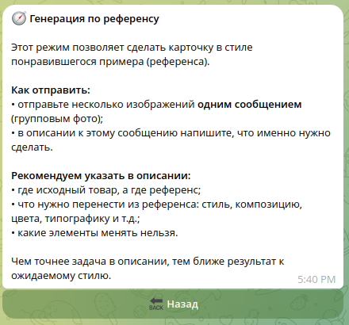

**Заголовок:** :mag: Генерация по референсу

**Содержание:**

Этот режим позволяет сделать карточку в стиле понравившегося примера (референса).

**Как отправить:**
- отправьте несколько изображений **одним сообщением** (групповым фото);
- в описании к этому сообщению напишите, что именно нужно сделать.

**Рекомендуем указать в описании:**
- где исходный товар, а где референс;
- что нужно перенести из референса: стиль, композицию, цвета, типографику и т.д.;
- какие элементы менять нельзя.

Чем точнее задача в описании, тем ближе результат к ожидаемому стилю.

---

### 3.7. Объединение объектов (планируется)

> 📎 Прототип: 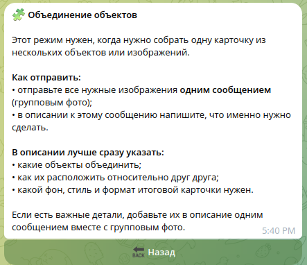

**Заголовок:** :jigsaw: Объединение объектов

**Содержание:**

Этот режим нужен, когда нужно собрать одну карточку из нескольких объектов или изображений.

**Как отправить:**
- отправьте все нужные изображения **одним сообщением** (групповым фото);
- в описании к этому сообщению напишите, что именно нужно сделать.

**В описании лучше сразу указать:**
- какие объекты объединить;
- как их расположить относительно друг друга;
- какой фон, стиль и формат итоговой карточки нужен.

Если есть важные детали, добавьте их в описание одним сообщением вместе с групповым фото.

---

## 4. Баланс и тарифы

### 4.1. Экран баланса

> 📎 Прототип: 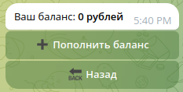

Отображается текст:

> Ваш баланс: **0 рублей**

Inline-кнопки:
- `+ Пополнить баланс`
- `Тарифы`
- `Назад` (:back:)

### 4.2. Экран тарифов

> 📎 Прототип: 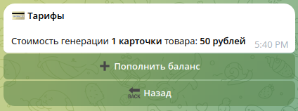

Отображается текст:

> :receipt: Тарифы
>
> Стоимость генерации 1 карточки товара: настраивается через админ-панель (по умолчанию 50 руб.)

Inline-кнопки:
- `+ Пополнить баланс`
- `Назад` (:back:)

---

## 5. Раздел "Информация" (дополнительное меню)

> 📎 Прототип: 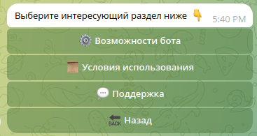

Сообщение:

> Выберите интересующий раздел ниже

Inline-кнопки (в столбик):
- :rocket: Возможности бота
- :scroll: Условия использования
- :speech_balloon: Поддержка
- :back: Назад

### 5.1. Возможности бота

> 📎 Прототип: 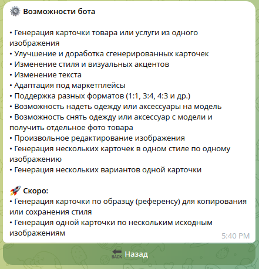

**Заголовок:** :rocket: Возможности бота

**Список возможностей:**
- Генерация карточки товара или услуги из одного изображения
- Улучшение и доработка сгенерированных карточек
- Изменение стиля и визуальных акцентов
- Изменение текста
- Адаптация под маркетплейсы
- Поддержка разных форматов (1:1, 3:4, 4:3 и др.)
- Возможность надеть одежду или аксессуары на модель
- Возможность снять одежду или аксессуар с модели и получить отдельное фото товара
- Произвольное редактирование изображения
- Генерация нескольких карточек в одном стиле по одному изображению
- Генерация нескольких вариантов одной карточки

**Планируется:**
- Генерация карточки по образцу (референсу) для копирования или сохранения стиля
- Генерация одной карточки по нескольким исходным изображениям

---

### 5.2. Условия использования

> 📎 Прототип: 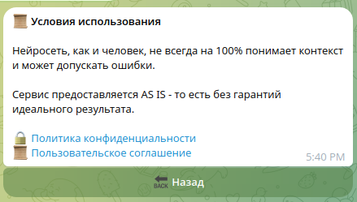

**Заголовок:** :scroll: Условия использования

**Содержание:**

Нейросеть, как и человек, не всегда на 100% понимает контекст и может допускать ошибки.

Сервис предоставляется AS IS — то есть без гарантий идеального результата.

Inline-кнопки (URL, открываются в Telegram Instant View):
- :lock: [Политика конфиденциальности](https://telegra.ph/Politika-konfidencialnosti-04-07-44)
- :lock: [Пользовательское соглашение](https://telegra.ph/Polzovatelskoe-soglashenie-04-07-29)
- :back: Назад

---

### 5.3. Поддержка

> 📎 Прототип: 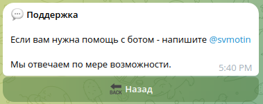

**Заголовок:** :speech_balloon: Поддержка

**Содержание:**

Если вам нужна помощь с ботом — напишите **@cardmaker18**

Мы отвечаем по мере возможности.

---

## 6. Основная функциональность (бизнес-логика)

### 6.1. Генерация карточки (реализовано)

> 📎 Прототип: 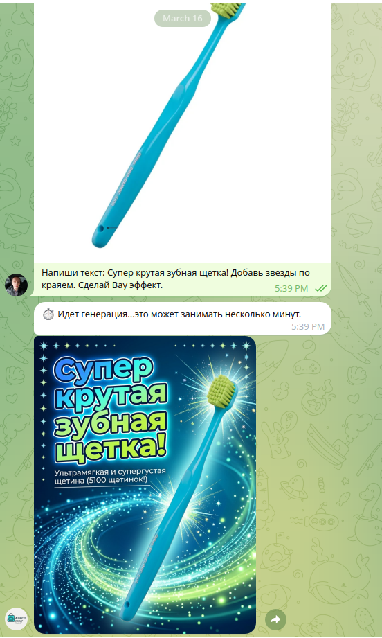

- Пользователь отправляет **одно изображение + текст** одним сообщением
- Бот анализирует изображение и текст, генерирует карточку товара/услуги
- Стоимость: настраивается через админ-панель
- Перед генерацией проверяется баланс пользователя

### 6.2. Редактирование/доработка (планируется)

- Пользователь отправляет сгенерированную (или любую) карточку + текст с описанием правок
- Бот вносит изменения в изображение
- Текст для замены указывается в кавычках

### 6.3. Генерация нескольких карточек (планируется)

- Автоматический режим: пользователь указывает количество, бот сам распределяет контент
- Ручной режим: пользователь описывает содержимое каждой карточки
- Максимум: **10 карточек/вариантов** за один запрос

### 6.4. Генерация по референсу (планируется)

- Пользователь отправляет несколько изображений групповым фото
- В описании указывает, где товар, где референс, что перенести из референса

### 6.5. Объединение объектов (планируется)

- Пользователь отправляет несколько изображений групповым фото
- В описании указывает, какие объекты объединить и как расположить

### 6.6. Форматы изображений (реализовано)

Поддерживаемые форматы:
- **1:1** — квадрат
- **3:4** — вертикальный (маркетплейсы)
- **4:3** — горизонтальный (Авито)
- **9:16** — сторис, reels
- Автоматический подбор формата по умолчанию

---

## 7. Система оплаты (реализовано)

> 📎 Прототип: 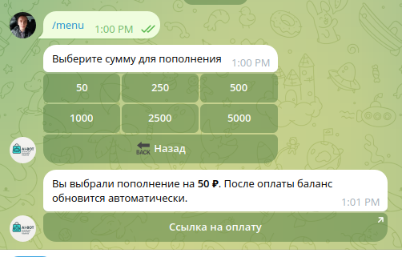 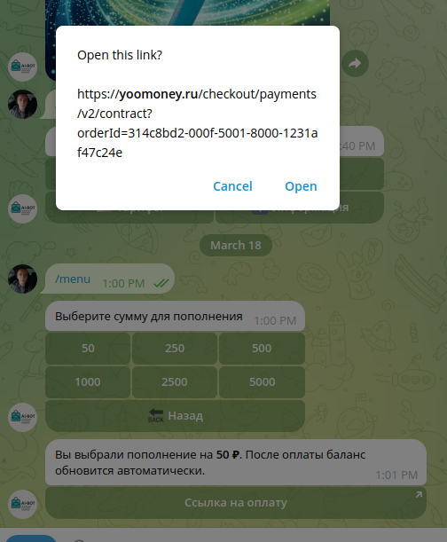

- Баланс пользователя в рублях (хранится в копейках)
- Оплата через **YooMoney** (quickpay + webhook-уведомления)
- Стоимость генерации настраивается через админ-панель
- Суммы пополнения: 100, 300, 500, 1000 руб.

---

## 8. Навигация

- Все информационные экраны имеют кнопку **"Назад"** (:back:) для возврата к предыдущему меню
- Кнопки реализованы как Telegram Inline Keyboard
- Переходы между разделами через callback-кнопки (не отдельные сообщения, а редактирование текущего)

---

## 9. Техническая платформа

- **Платформа:** Telegram Bot API (grammY)
- **Тип интерфейса:** Inline Keyboard кнопки
- **Генерация изображений:** OpenRouter API (модель gpt-image-1.5)
- **База данных:** SQLite (better-sqlite3)
- **Оплата:** YooMoney quickpay + webhook
- **Хранение данных:** баланс пользователей, история генераций, платежи
- **Поддержка:** @cardmaker18
